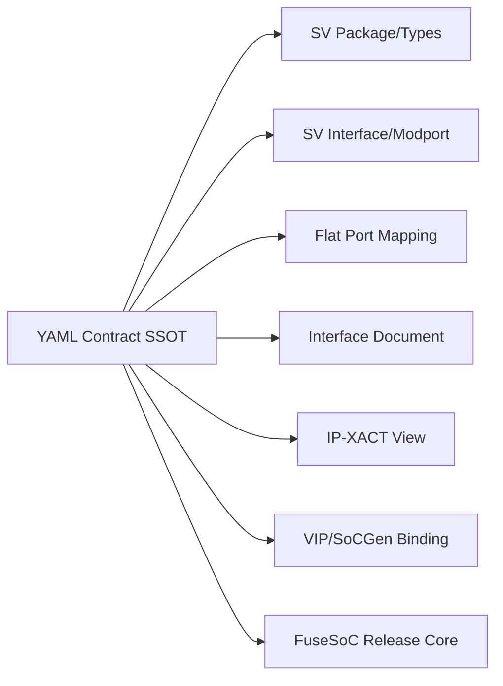
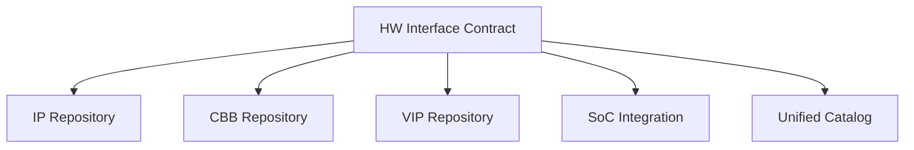

# 架构指南

> 本目录描述 HW Interface Repo 的总体技术架构。详细规划见 [`plan.md`](plan.md:150) 第 5 节。

## 1. 四层契约模型

| 层次 | 内容 | 主要消费者 |
|---|---|---|
| L0 Identity | ID、名称、版本、协议引用、Owner、成熟度 | Catalog、发布系统 |
| L1 Semantic | 角色、通道、信号、事务、时序、错误和顺序语义 | 架构、设计、验证 |
| L2 Configuration | 参数、Profile、Capability、合法组合、默认值 | IP 配置、SoCGen、VIP |
| L3 Realization | SV types/interface/flat ports、IP-XACT、文档视图 | RTL、EDA、验证、交付 |

## 2. 事实与派生物

**禁止多处手工维护**：信号名、宽度表达式和方向；必选/可选属性；参数默认值与约束；
role/channel 映射；tie-off 规则；capability/profile 组成；兼容性声明。

## 3. 三视图并存策略

| 视图 | 适用 | 说明 |
|---|---|---|
| A. Packed Struct | 内部 RTL 首选 | 端口少、类型安全、易数组化、request/response 分离 |
| B. SV Interface | VIP/TB/modport | virtual interface、clocking block、局部集成 |
| C. Flattened Ports | IP 交付边界 | Verilog/VHDL 混合、DFT/CDC/网表、第三方 IP |

`generated/` 中派生文件禁止手工修改。

## 4. 与其它仓库的关系

- Interface Core 不反向依赖 IP / CBB / VIP，防止依赖环；
- 边界判定见 [`plan.md`](plan.md:98) 第 3.3 节。

## 5. FuseSoC 定位

FuseSoC 负责依赖、编译顺序、fileset 与 target，**不承担接口语义建模**。
每个接口族作为独立 Core 发布（`aix:interface:<name>:<semver>`）。

## 6. 目标 Target

| Target | 用途 |
|---|---|
| `default` | RTL/IP/VIP 依赖的 SV 视图 |
| `contract` | 仅获取 YAML Contract/Profile |
| `lint` | 类型、interface 和 wrapper 静态检查 |
| `compile_smoke` | 最小编译/展开 |
| `roundtrip` | struct↔interface↔flat 一致性测试 |
| `compatibility_test` | 接口匹配规则测试 |
| `example` | 最小消费者示例 |
| `package` | 生成 Release 包 |
